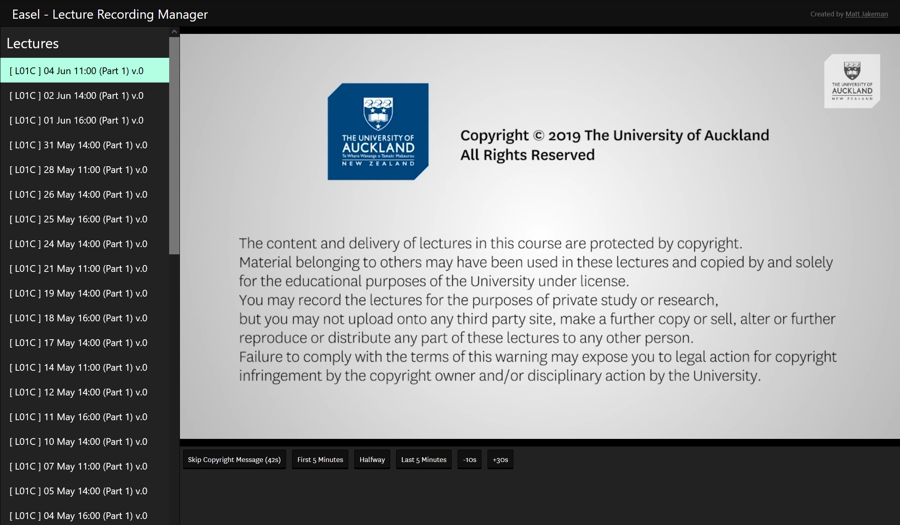
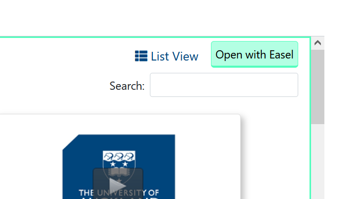

# Easel
A suite of enhancements for watching lecture recordings at the University of Auckland.

**easel** (ea•sel ē′zəl)
*n.* An upright frame for displaying or supporting something, such as a [Canvas](https://canvas.auckland.ac.nz/).



**Note:** This extension simply wraps the existing lecture recording interface. You must be a current student at the University of Auckland in order to use this tool.

## Get the Addon
Currently Easel is only available for Firefox. Chrome and Edge versions are planned - contributions welcome!

<a href="https://github.com/mjakeman/easel/releases/download/v0.2/easel-firefox.xpi" target="_blank">
  
</a>

## How to Use
Open the lecture recordings tab on Canvas. If everything is set up correctly, you will see the following button:



Click this and you're done! 

## For Developers
### Debugging
Run concurrently (in two separate terminals at the same time):
```sh
# Terminal 1
$ npm run watch

# Terminal 2
$ web-ext run
```

### Building
```sh
$ web-ext build
```
