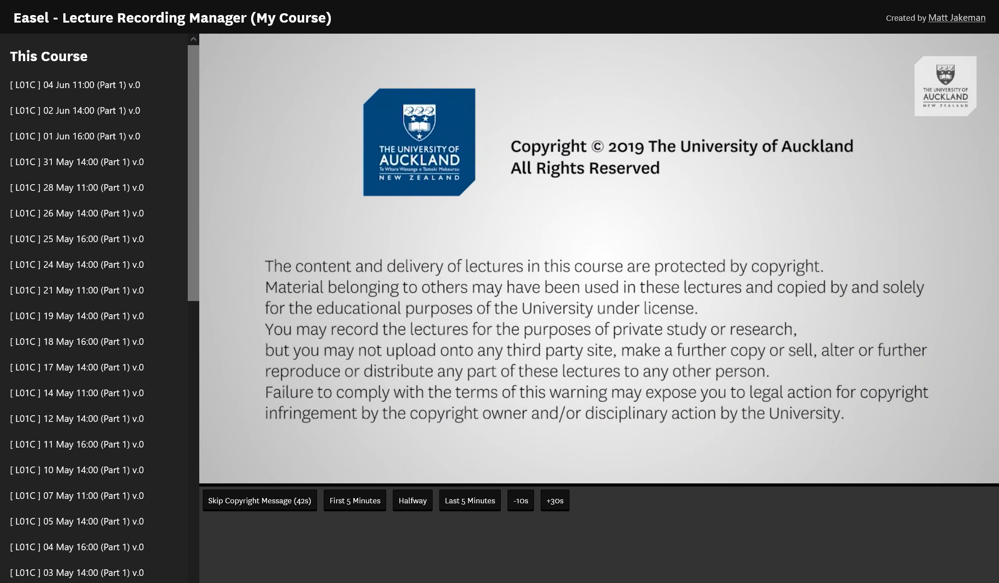
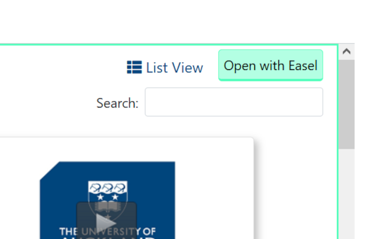

# Easel
[](https://github.com/mjakeman/easel/actions/workflows/node.js.yml)


A suite of enhancements for watching lecture recordings at the University of Auckland.

**easel** (ea•sel ē′zəl)
*n.* An upright frame for displaying or supporting something, such as a [Canvas](https://canvas.auckland.ac.nz/).



**Note:** This extension simply wraps the existing lecture recording interface. You must be a current student at the University of Auckland in order to use this tool.

## Get the Addon
Easel is available on Mozilla Addons. A chrome version is in the works, awaiting review for the Chrome Web Store (stay tuned!).

<a href="https://addons.mozilla.org/en-GB/firefox/addon/easel-uoa/" target="_blank">
  
</a>

## How to Use
Open the lecture recordings tab on Canvas. If everything is set up correctly, you will see the following button:



Click this and you're done! 

## For Developers
### Obtaining the Source
Clone the repository and install dependencies with `npm`. You will need either node.js 14 or 15 installed for this.

```
# Clone repository
$ git clone https://github.com/mjakeman/easel

# Install dependencies
$ npm install
```

### Development/Debugging
Run concurrently (in two separate terminals at the same time):
```sh
# Terminal 1
$ npm run watch

# Terminal 2
$ web-ext run -s src --no-config-discovery
```

### Building
```sh
$ npm run build
$ web-ext build -s src --no-config-discovery
```

### Testing
In addition to the University's lecture recording infrastructure, easel can also be tested on [easel-mock](https://www.mattjakeman.com/easel/easel-uoa-mock/) which does not need a University-issued account to use. It is a simple static website that emulates the layout of the official university tool and provides 'fake data' to test the browser extension.

### Disclaimer
Easel is not associated with the University. It does not host any copyrighted material and does not allow or faciliate bypassing University authentication in any way, shape, or form. That aside, enjoy! :)
